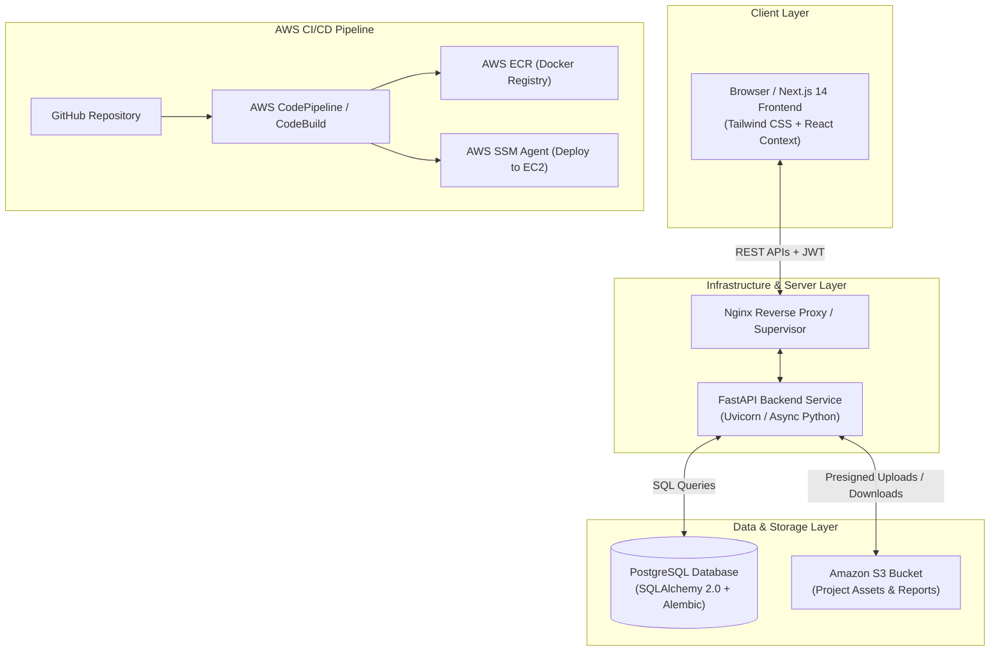
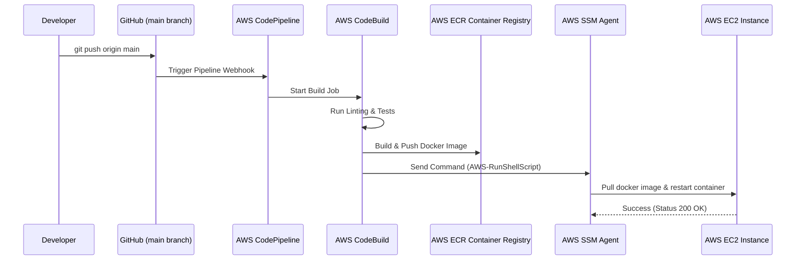

# Building & Deploying a Production-Grade Project Submission & Review Portal with Next.js 14, FastAPI, PostgreSQL, and AWS

*A deep dive into building a full-stack project management and evaluation platform with asynchronous Python APIs, modern React App Router, secure S3 object storage, and automated AWS CI/CD pipelines.*

---

## 📌 Executive Summary & Introduction

In academic institutions, bootcamp environments, and engineering teams, managing software project submissions is often surprisingly chaotic. Project reports, presentation slides, source code archives, and demo screenshots end up scattered across Google Drives, email threads, Slack channels, and local machines. Reviewers struggle to maintain context, track revision histories, or deliver structured feedback.

To solve this problem, we designed and built the **Project Submission & Review Portal**—a centralized, full-stack web application designed for seamlessly managing project submissions, asset uploads, and review workflows.

In this technical blog post, we'll walk through the complete lifecycle of designing, engineering, containerizing, and deploying this system to **AWS EC2** using **AWS CodePipeline, ECR, SSM**, and **Supervisor**.

---

## 🏗️ High-Level System Architecture

The architecture follows a decoupled full-stack model where the Next.js frontend handles state and rendering, communicating with a high-performance Python FastAPI backend via RESTful APIs. Data persistence is handled by PostgreSQL for relational data and Amazon S3 for binary assets.



### Tech Stack Overview

| Layer | Technology | Key Responsibility |
|---|---|---|
| **Frontend** | Next.js 14 (App Router), TypeScript, Tailwind CSS | Server-rendered pages, responsive UI, client-side state |
| **Backend** | Python 3.11, FastAPI, Pydantic v2 | High-concurrency REST API, business logic, authorization |
| **Database** | PostgreSQL 14+, SQLAlchemy 2.0, Alembic | Relational schema, migrations, data integrity |
| **Object Storage** | Amazon S3 (boto3) | Secure storage for screenshots, PDFs, ZIP files |
| **Authentication** | JWT (Access + Refresh Tokens), Passlib (Bcrypt) | Secure auth with httpOnly cookies & bearer tokens |
| **Orchestration** | Docker, Supervisor | Unified single-container service runner |
| **DevOps / Hosting** | AWS EC2, ECR, CodePipeline, CodeBuild, SSM | Automated zero-downtime CI/CD pipeline |

---

## 🔑 Core Features & System Capabilities

1. **Role-Based Authentication & Authorization**:
   - Distinct user roles: **Student / Submitter**, **Reviewer**, and **Admin**.
   - Secure access tokens with refresh token rotation.

2. **End-to-End Project Lifecycle Management**:
   - Status state machine: `Draft` ➔ `Submitted` ➔ `Under Review` ➔ `Approved` / `Changes Requested`.
   - Rich project metadata: Title, description, categories, tech stack badges, repository links, and live demo links.

3. **Cloud Asset Management**:
   - Drag-and-drop file uploads for screenshots, documentation (PDFs/PPTs), and code archives.
   - S3 object storage with file validation (MIME type restrictions & size limits).

4. **Interactive Feedback & Review System**:
   - Inline score assignments and structured reviewer comments.
   - Resubmission workflows when revisions are requested.

---

## 🛠️ Backend Deep Dive: FastAPI & PostgreSQL

### 1. Database Schema Design (SQLAlchemy 2.0)

The relational schema is built around four core entities: `User`, `Project`, `ProjectFile`, and `RefreshToken`.

```python
# app/models/project.py
import enum
from sqlalchemy import Column, Integer, String, Text, ForeignKey, Enum, DateTime
from sqlalchemy.orm import relationship
from app.core.database import Base

class ProjectStatus(str, enum.Enum):
    DRAFT = "DRAFT"
    SUBMITTED = "SUBMITTED"
    UNDER_REVIEW = "UNDER_REVIEW"
    APPROVED = "APPROVED"
    CHANGES_REQUESTED = "CHANGES_REQUESTED"

class Project(Base):
    __tablename__ = "projects"

    id = Column(Integer, primary_key=True, index=True)
    title = Column(String(255), nullable=False)
    description = Column(Text, nullable=False)
    category = Column(String(100), nullable=False)
    tech_stack = Column(String(255), nullable=False)
    github_url = Column(String(500), nullable=True)
    demo_url = Column(String(500), nullable=True)
    status = Column(Enum(ProjectStatus), default=ProjectStatus.DRAFT, nullable=False)
    
    owner_id = Column(Integer, ForeignKey("users.id", ondelete="CASCADE"), nullable=False)
    owner = relationship("User", back_populates="projects")
    files = relationship("ProjectFile", back_populates="project", cascade="all, delete-orphan")
```

### 2. AWS S3 Integration Service

To keep file storage decoupled from the application server, files are uploaded directly to S3 via Amazon SDK (`boto3`), storing object keys and metadata in PostgreSQL:

```python
# app/services/s3_service.py
import boto3
from app.core.config import settings

s3_client = boto3.client(
    "s3",
    aws_access_key_id=settings.AWS_ACCESS_KEY_ID,
    aws_secret_access_key=settings.AWS_SECRET_ACCESS_KEY,
    region_name=settings.AWS_REGION,
)

def upload_file_to_s3(file_obj, object_name: str, content_type: str) -> str:
    s3_client.upload_fileobj(
        file_obj,
        settings.AWS_S3_BUCKET,
        object_name,
        ExtraArgs={"ContentType": content_type}
    )
    return f"https://{settings.AWS_S3_BUCKET}.s3.{settings.AWS_REGION}.amazonaws.com/{object_name}"
```

---

## 🎨 Frontend Deep Dive: Next.js 14 App Router

The frontend uses Next.js 14 with TypeScript and Tailwind CSS, benefiting from server components for initial renders and client components for interactive forms and real-time status updates.

### Axios Interceptor for Automatic Token Refresh

To deliver a seamless user experience, an Axios response interceptor automatically handles `401 Unauthorized` errors by attempting a token refresh before retrying failed API calls:

```typescript
// src/lib/axios.ts
import axios from 'axios';

const api = axios.create({
  baseURL: process.env.NEXT_PUBLIC_API_URL || 'http://localhost:8000',
  withCredentials: true,
});

api.interceptors.response.use(
  (response) => response,
  async (error) => {
    const originalRequest = error.config;
    if (error.response?.status === 401 && !originalRequest._retry) {
      originalRequest._retry = true;
      try {
        await api.post('/auth/refresh');
        return api(originalRequest);
      } catch (refreshError) {
        window.location.href = '/login';
        return Promise.reject(refreshError);
      }
    }
    return Promise.reject(error);
  }
);

export default api;
```

---

## 🐳 Dockerization & Multi-Process Orchestration

To streamline deployment onto a single EC2 instance without managing multiple containers, we created a **multi-stage Dockerfile** that compiles the Next.js static build and runs both FastAPI and Next.js under **Supervisor**:

```dockerfile
# Dockerfile
FROM node:18-alpine AS frontend-builder
WORKDIR /app/frontend
COPY frontend/package*.json ./
RUN npm ci
COPY frontend/ ./
RUN npm run build

FROM python:3.11-slim
WORKDIR /app
RUN apt-get update && apt-get install -y --no-install-recommends \
    curl libpq5 supervisor \
    && curl -fsSL https://deb.nodesource.com/setup_18.x | bash - \
    && apt-get install -y nodejs \
    && rm -rf /var/lib/apt/lists/*

COPY backend/requirements.txt ./backend/
RUN pip install --no-cache-dir -r backend/requirements.txt
COPY backend/ ./backend/

COPY --from=frontend-builder /app/frontend/.next ./frontend/.next
COPY --from=frontend-builder /app/frontend/public ./frontend/public
COPY --from=frontend-builder /app/frontend/package*.json ./frontend/
COPY --from=frontend-builder /app/frontend/node_modules ./frontend/node_modules

COPY supervisord.conf /etc/supervisor/conf.d/supervisord.conf

ENV PYTHONPATH=/app/backend NODE_ENV=production
EXPOSE 8000 3000

CMD ["/usr/bin/supervisord", "-c", "/etc/supervisor/conf.d/supervisord.conf"]
```

### Supervisor Process Configuration (`supervisord.conf`)

```ini
[supervisord]
nodaemon=true
logfile=/var/log/supervisor/supervisord.log
pidfile=/var/run/supervisord.pid

[program:backend]
command=uvicorn app.main:app --host 0.0.0.0 --port 8000
directory=/app/backend
autostart=true
autorestart=true
stdout_logfile=/dev/stdout
stdout_logfile_maxbytes=0
stderr_logfile=/dev/stderr
stderr_logfile_maxbytes=0

[program:frontend]
command=npm run start -- -p 3000
directory=/app/frontend
autostart=true
autorestart=true
stdout_logfile=/dev/stdout
stdout_logfile_maxbytes=0
stderr_logfile=/dev/stderr
stderr_logfile_maxbytes=0
```

---

## 🚀 AWS CI/CD Pipeline & Continuous Deployment

Deployments are triggered automatically whenever code is pushed to the `main` branch on GitHub.



### CodeBuild Buildspec (`buildspec.yml`)

```yaml
version: 0.2

env:
  variables:
    AWS_REGION: "ap-south-1"
    IMAGE_REPO_NAME: "project-portal"
  parameter-store:
    EC2_INSTANCE_ID: "/project-portal/ec2-instance-id"

phases:
  pre_build:
    commands:
      - echo "Logging in to Amazon ECR..."
      - aws ecr get-login-password --region $AWS_REGION | docker login --username AWS --password-stdin $AWS_ACCOUNT_ID.dkr.ecr.$AWS_REGION.amazonaws.com
      - REPOSITORY_URI=$AWS_ACCOUNT_ID.dkr.ecr.$AWS_REGION.amazonaws.com/$IMAGE_REPO_NAME
      - COMMIT_HASH=$(echo $CODEBUILD_RESOLVED_SOURCE_VERSION | cut -c1-7)
      - IMAGE_TAG=${COMMIT_HASH:-latest}

  build:
    commands:
      - echo "Building Docker image..."
      - docker build -t $REPOSITORY_URI:latest -t $REPOSITORY_URI:$IMAGE_TAG .

  post_build:
    commands:
      - echo "Pushing Docker image to ECR..."
      - docker push $REPOSITORY_URI:latest
      - docker push $REPOSITORY_URI:$IMAGE_TAG
      - echo "Deploying container updates to EC2 via AWS SSM..."
      - |
        aws ssm send-command \
          --instance-ids "$EC2_INSTANCE_ID" \
          --document-name "AWS-RunShellScript" \
          --parameters 'commands=[
            "aws ecr get-login-password --region ap-south-1 | docker login --username AWS --password-stdin '$AWS_ACCOUNT_ID'.dkr.ecr.ap-south-1.amazonaws.com",
            "docker pull '$REPOSITORY_URI':latest",
            "docker stop project-portal || true",
            "docker rm project-portal || true",
            "docker run -d --name project-portal --restart always -p 80:3000 -p 8000:8000 --env-file /home/ubuntu/.env '$REPOSITORY_URI':latest"
          ]' \
          --region $AWS_REGION
```

---

## ⚡ Challenges Overcome & Lessons Learned

1. **Cross-Origin Cookie Security in Production**:
   - *Challenge*: Auth cookies were getting rejected in cross-origin environments between frontend (port 3000) and backend (port 8000).
   - *Solution*: Configured `SameSite=Lax` for standard HTTP deployment and `SameSite=None; Secure` when serving over HTTPS behind an AWS ALB or Nginx reverse proxy.

2. **Database Schema Evolution with Alembic**:
   - *Challenge*: Keeping production schema synced without data loss during automated deployments.
   - *Solution*: Added an inline container startup command executing `alembic upgrade head` before spawning the Uvicorn worker process.

3. **Build Caching in CodeBuild**:
   - *Challenge*: High build times due to repeated `npm install` and Python package downloads.
   - *Solution*: Configured CodeBuild path caching for `frontend/node_modules` and `backend/venv`, reducing build times by over 60%.

---

## 🎯 Conclusion & Next Steps

Building the **Project Submission & Review Portal** provided a solid template for full-stack engineering with modern tools:
- **FastAPI** provides robust, auto-documented endpoints with async speed.
- **Next.js 14** provides high-performance rendering and a slick user UI.
- **Amazon S3 & PostgreSQL** ensure secure, scalable storage.
- **AWS CodePipeline, ECR, and SSM** enable hands-off continuous integration and deployment.

### Future Enhancements
- 🔔 Real-time WebSocket notifications when a review is posted.
- 📄 Automated PDF preview generation directly in the web browser.
- 🛡️ OAuth2 integration (Google & GitHub Sign-In).

---

*Written for software developers, cloud architects, and full-stack engineers.*
